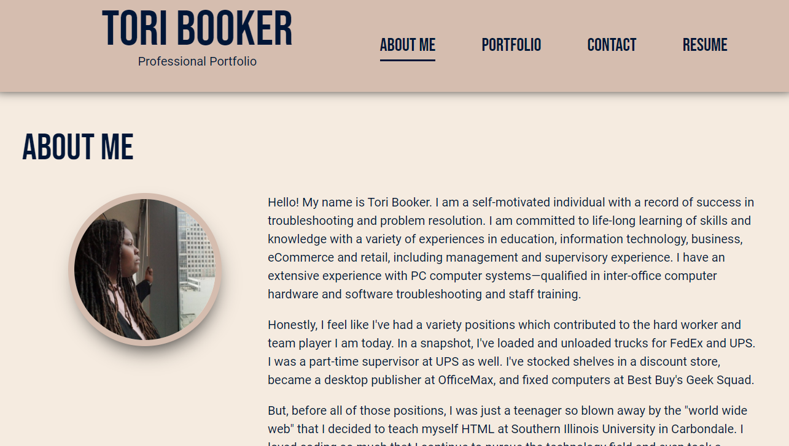
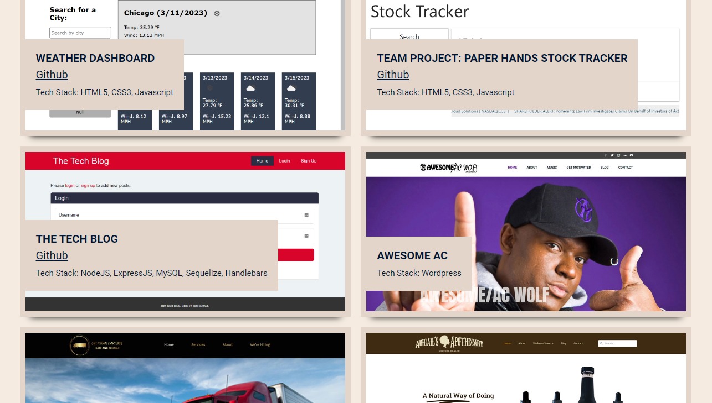
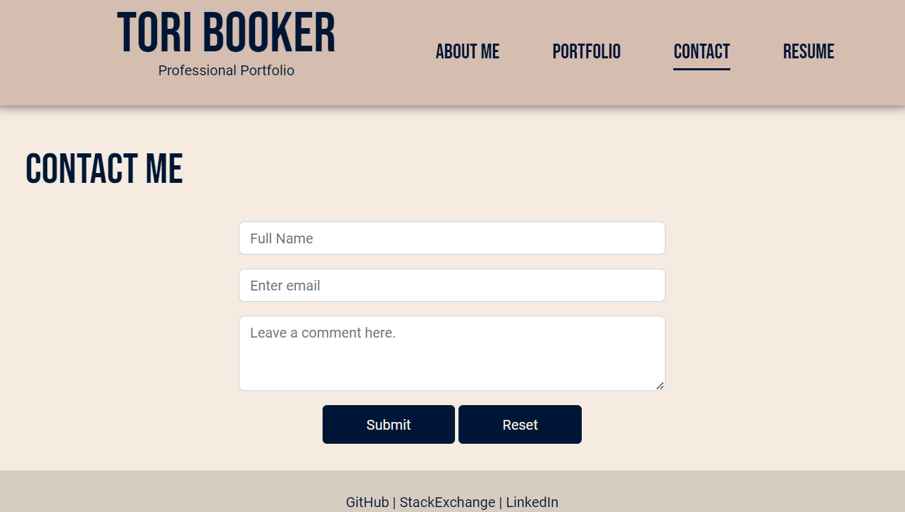
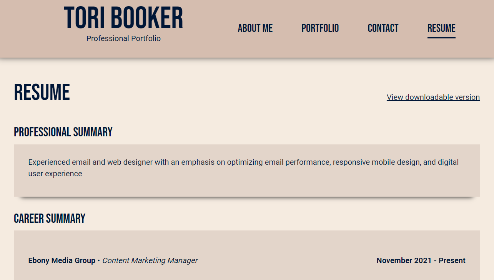

# Professional React Portfolio

## Table of Contents

1. [Description](#desc)
2. [Installation](#install)
3. [Usage](#usage)
4. [Screenshots](#demo)
5. [License](#license)

## Description

This is my professional online portfolio built using React technology. This single-page application features some of my Github projects, Wordpress websites built for clients, as well as my resume and technical skills.

 
## Installation

1. Clone this repo.
2. Using your terminal, navigate to the project folder and enter `code .` to open Visual Studio.
3. Install this application's dependencies by entering `npm install` into your terminal.
4. Start React by entering `npm start` into your terminal.

 
## Usage

* Visit the live application [here](http://ebonygrrl.github.io/react-portfolio). 
* Simply click on the navigation title that you would like to view.

 
## Screenshots

 
## License

All code is released under the [GNU General Public License](https://www.gnu.org/licenses/gpl-3.0.en.html).
